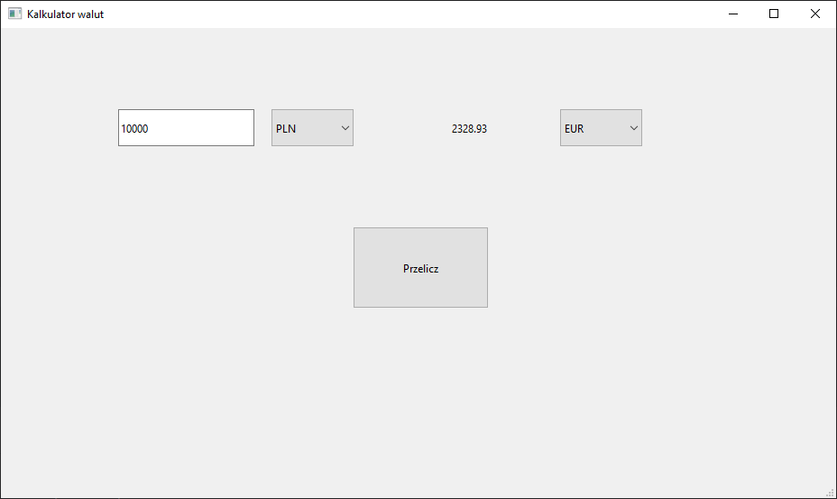

# Currency Converter

Prosty konwerter walut zbudowany w C++ i Qt6 z graficznym interfejsem użytkownika (GUI). Aplikacja pobiera aktualne kursy walut z API exchangerate.host i przelicza wskazaną kwotę między różnymi walutami.

## 🖥️ Zrzut ekranu

## Funkcje

- Interfejs graficzny zbudowany w Qt Designer
- Obsługa wielu walut (USD, EUR, PLN, GBP, JPY)
- Automatyczne pobieranie kursów z zewnętrznego API
- Przeliczanie kwot w czasie rzeczywistym

## Jak uruchomić

Upewnij się, że masz zainstalowane:
   - Qt 6.9 (lub wyższy)
   - CMake 3.22 lub wyższy
   - Kompilator (np. MinGW)
